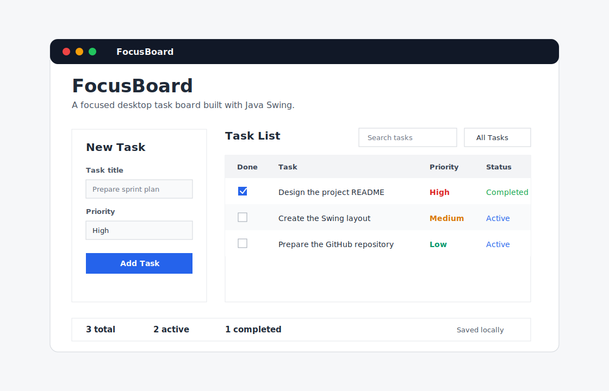

# FocusBoard


FocusBoard is a polished Java Swing desktop application for managing daily tasks with a simple, professional interface. It demonstrates desktop UI development, local data persistence, table-based interaction, filtering, search, and Maven project structure.

## Preview



## Highlights

- Clean desktop UI built with standard Java Swing.
- Add, complete, delete, search, and filter tasks.
- Automatic local persistence, so tasks remain after closing the app.
- MVC-inspired structure with separate classes for model, table logic, filtering, and storage.
- Maven build configuration with an executable JAR.
- GitHub Actions workflow for continuous integration.

## Features

- Create tasks with a title and priority.
- Mark tasks as active or completed.
- Filter by all, active, or completed tasks.
- Search tasks by title or priority.
- Clear completed tasks in one action.
- View live totals for all, active, and completed tasks.
- Save task data automatically in the user's local profile.

## Tech Stack

- Java 17
- Java Swing
- Maven
- GitHub Actions

## Getting Started

### Requirements

- Java 17 or later
- Maven 3.8 or later

### Run with Maven

```bash
mvn clean package
mvn exec:java
```

### Run the JAR

```bash
java -jar target/focusboard-1.0.0.jar
```

### Run without Maven

```bash
mkdir -p out
javac -d out src/main/java/com/example/focusboard/*.java
java -cp out com.example.focusboard.FocusBoardApp
```

## Project Structure

```text
src/main/java/com/example/focusboard/
  FocusBoardApp.java          Main Swing window and UI composition
  Task.java                   Task domain model
  Priority.java               Task priority enum
  FilterMode.java             Task filter enum
  TaskTableModel.java         JTable data model and filtering logic
  TaskRepository.java         Local file persistence
  SimpleDocumentListener.java Utility listener for live search
```

## What This Project Demonstrates

- Desktop application development with Java Swing.
- Event-driven UI programming.
- Separation of UI, domain, table model, and persistence responsibilities.
- File-based local storage with Java NIO.
- Maven packaging and GitHub-ready repository organization.

## Roadmap

- Add due dates and sorting.
- Add import and export actions.
- Add unit tests for task filtering and persistence.
- Add theme selection for light and dark modes.

## License

This project is licensed under the MIT License.
